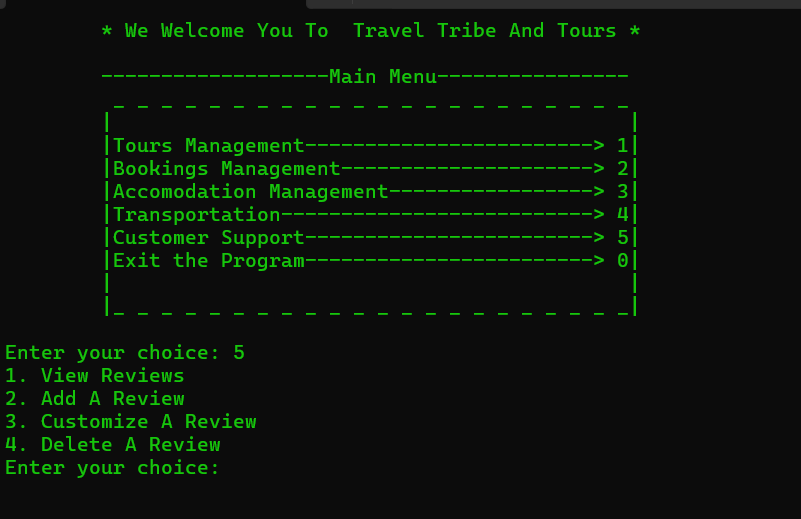

# 🌍 Travel & Tour Manager (C++)

A console-based **Travel and Tour Management System** built in C++.
This program helps manage **tour packages, bookings, accommodations, transportation, and customer reviews**, making it a beginner-friendly yet complete system for learning and practicing structured programming concepts.

---

## ✨ Features

* **Tour Packages Module**

  * Add, view, update, and delete available tour packages.
* **Booking System**

  * Manage customer bookings and reservations.
* **Accommodation Management**

  * Keep track of hotel stays and lodging information.
* **Transportation Records**

  * Log car rentals, flights, and other transport options.
* **Customer Reviews**

  * Collect and display customer feedback.
* **Menu-Based Navigation**

  * Simple and interactive console-driven menus for each module.

---

## 🛠️ Technologies Used

* **Language**: C++
* **Libraries**:

  * `<iostream>` (input/output)
  * `<iomanip>` (formatted display)
  * `<string>` (string handling)

---

## 🚀 How to Run

1. Clone the repository:

   ```bash
   git clone https://github.com/your-username/Travel_Tour_Manager.git
   cd Travel_Tour_Manager
   ```

2. Compile the program:

   ```bash
   g++ main.cpp -o Travel_Tour_Manager
   ```

3. Run the executable:

   ```bash
   ./Travel_Tour_Manager
   ```

---

## 📸 Sample Output

```
:::::::::::::::::::::::::::::::::::::::::::::::::::: TRAVEL & TOUR MANAGER :::::::::::::::::::::::::::::::::::::::::::::

 MAIN MENU
 A) Manage Tour Packages
 B) Manage Bookings
 C) Manage Accommodations
 D) Manage Transportation
 E) Customer Reviews
 F) Exit
```

---

## 🖼️ Screenshots / Preview

(Add your screenshots to a folder named `screenshots` in the repository, then link them here)

Example:


---

## 📚 Learning Outcomes

This project helps beginners practice:

* File handling in C++
* Menu-driven programming
* Structuring code into modules
* Record management (add, view, update, delete)
* Real-world case study for travel industry software

---

## 👨‍💻 Author

Developed by **Bilal Asif**

---
